# Teren Oi — анализ изменений в организационных документах

Hackathon team project. Teren Oi сопоставляет редакции внутренних положений: показывает добавленные, удалённые, изменённые и сохранённые пункты, а при подключённом AI ищет возможную потерю функций, дублирование и пересечение ответственности. Каждый AI-вывод должен ссылаться на фрагмент документа.

## Возможности демо

- **Проверка в 1 клик:** контрольный сценарий с заранее заполненными редакциями.
- **Ввод:** загрузка DOCX, TXT и PDF, либо вставка и редактирование текста прямо в интерфейсе.
- **Точный diff:** сопоставление по номеру пункта с показом исходных формулировок до и после.
- **AI-анализ по желанию:** исследуются только изменённые фрагменты; цитаты и номера пунктов проверяются приложением по переданным источникам.
- **Пять вкладок результата:** статусы подразделений, возможные потери, дублирование и конфликты ответственности, интерактивная матрица, экспорт заключения.
- **Экспорт:** заключение Markdown и полный diff в JSON.
- **Удобная рабочая область:** раздельные панели документов, заметные статусы и короткие переходы между состояниями; системная настройка `prefers-reduced-motion` отключает анимации.

> Контрольный набор синтетический и предназначен для демонстрации продукта. Он не содержит официальных документов или утверждений об АО «Казахтелеком». В интерфейсе кнопка называется «Загрузить контрольный демо-комплект Казахтелеком» в соответствии со сценарием хакатона.

## Запуск

Требуется Python 3.11 или новее. Из корня репозитория:

```bash
pip install -e .
streamlit run app.py
```

Для изолированной установки рекомендуется сначала создать виртуальное окружение (`py -m venv .venv` в Windows или `python -m venv .venv` в macOS/Linux) и активировать его.

### Включение AI

Без API-ключа приложение выполняет точное сравнение. Для AI-анализа каждый участник создаёт локальный `.env` из `.env.example` и задаёт `OPENAI_API_KEY`; модель можно указать через `OPENAI_MODEL`. `.env` исключён из Git — передавайте секреты через менеджер секретов, а не коммитами или сообщениями.

При запуске AI текст загруженных документов передаётся в OpenAI API для анализа. Не используйте конфиденциальные документы без разрешения их владельца и организации.

### PDF

DOCX и TXT работают на основных зависимостях проекта. Извлечение текста из PDF требует `pypdf` (`pip install pypdf`). Сканированные PDF без текстового слоя требуют OCR и пока не поддерживаются.

## Быстрый сценарий для судей и экспертов

1. Запустите приложение и откройте `http://localhost:8501`.
2. Нажмите **«Загрузить контрольный демо-комплект Казахтелеком»** — пример заполнится и сравнение запустится автоматически. Для этого шага API-ключ не нужен.
3. На вкладке **«Подразделения»** просмотрите эвристически извлечённые названия и количество пунктов по статусам.
4. На вкладке **«Потери функций»** проверьте удалённые пункты. Удаление пункта помечается для ручной проверки и само по себе не доказывает потерю функции.
5. Для поиска смысловых потерь, дублирования и пересечения ответственности задайте API-ключ и включите AI-анализ. Сверьте каждый вывод с цитатами и номером пункта.
6. В **«Матрице маппинга»** сравните исходный и новый тексты. Скачайте заключение Markdown или полный JSON на вкладке **«Экспорт заключения»**.

В контрольном наборе есть ожидаемые структурные изменения: пункт **2.2** удалён, **2.3** изменён, **2.4** добавлен; **2.1** и **2.5** совпадают. Это позволяет за минуту проверить, что загрузка/ввод, подсчёт, таблица и экспорт связаны в одном работающем сценарии. AI-смысловые выводы зависят от наличия ключа и ответа модели.

### Проверка на своих файлах

1. Переключите источник обеих редакций на **«Файл»** и выберите DOCX/TXT (или PDF при установленном `pypdf`), либо оставьте **«Текст»** и вставьте фрагменты.
2. Нажмите **«Сравнить редакции»**. Для лучшего сопоставления сохраняйте номера пунктов (`2.1`, `2.2`, …) в обеих редакциях.
3. Сверьте несколько совпавших, изменённых и удалённых пунктов вручную.
4. Если включён AI, отдельно проверьте каждую цитату и её трактовку. Анализ помогает найти места для проверки, но не заменяет экспертное заключение.

## Архитектура

```mermaid
flowchart LR
    U[DOCX / PDF / TXT / вставленный текст] --> UI[Streamlit: app.py]
    UI --> R[Чтение источника и нормализация]
    R --> M[SourceDocument и Clause]
    M --> D[Точный diff по номеру пункта]
    D --> V[Подразделения · Потери · Дубли · Матрица]
    D -->|если задан API key и выбран AI| A[AI-анализ изменённых пунктов]
    A --> C[Проверка цитат и ссылок на пункты]
    C --> V
    V --> E[Markdown заключение и JSON diff]
```



### Модули

| Путь | Назначение |
| --- | --- |
| `app.py` | Сценарий интерфейса, ввод, вкладки результата, запуск сравнения и экспорт |
| `src/teren_oi/models.py` | Общий контракт `Clause`, `SourceDocument`, `Comparison`, `Finding` |
| `src/teren_oi/docx_reader.py` | Извлечение текста пунктов DOCX |
| `src/teren_oi/diff.py` | Точное сравнение редакций по идентификаторам пунктов |
| `src/teren_oi/analyzer.py` | Необязательный структурированный AI-анализ и валидация цитат |
| `src/teren_oi/report.py` | Формирование Markdown и JSON отчётов |

## Границы и следующие улучшения

- Сопоставление идёт по номерам пунктов. Если пункт перенумерован, он может выглядеть как удалённый и новый.
- Статусы подразделений строятся по найденным в изменённых формулировках названиям и точным статусам пунктов; это эвристика, а не готовая модель оргструктуры.
- PDF поддерживается только при наличии извлекаемого текстового слоя. OCR для сканов пока не реализован.
- AI-анализ ограничен переданными фрагментами и использует машинно проверяемые цитаты. Человек должен сверить смысл вывода с полным документом.
- Следующие этапы: сопоставление перенумерованных функций по смыслу, извлечение подразделений по структуре документа, OCR и форматированный PDF/DOCX-отчёт.
