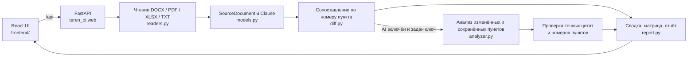

# Teren Oi

**Сравнение редакций организационных документов с проверяемыми источниками.** Teren Oi показывает, какие пункты добавились, исчезли или изменились. Дополнительный AI-анализ помогает найти возможную потерю функций и дублирование ответственности; каждый такой вывод сопровождается цитатой, которую можно сверить с документом.

Проект создан командой для хакатона HackAlem AI. Главный сценарий — открыть приложение, запустить синтетический пример одним нажатием, изучить изменения и скачать заключение.

## Быстрый запуск

Нужны Python 3.11+ и Node.js с npm. Из корня репозитория откройте два терминала.

**Терминал 1 — Python API:**

```bash
pip install -e .
uvicorn teren_oi.web:app --reload
```

**Терминал 2 — интерфейс:**

```bash
cd frontend
npm install
npm run dev
```

Откройте **http://localhost:5173**. Vite передаёт запросы `/api` локальному API на `http://127.0.0.1:8000`. Для изолированной установки Python сначала создайте и активируйте виртуальное окружение.

Для экспорта PDF используется `reportlab` и шрифт TrueType с кириллицей (Arial, DejaVu Sans или Liberation Sans). Если на сервере нет подходящего системного шрифта, положите `DejaVuSans.ttf` в `src/teren_oi/fonts/`. Экспорт Word использует `python-docx`.

### AI по желанию

Приложение работает без ключа: точное сравнение пунктов и экспорт остаются доступны. Чтобы включить AI-анализ, создайте **локальный** `.env` по образцу `.env.example` и задайте `OPENAI_API_KEY`; при необходимости поменяйте `OPENAI_MODEL`. В интерфейсе AI включается отдельно для каждого анализа.

`.env` исключён из Git. У каждого участника команды должен быть собственный локальный ключ; в репозиторий входит только `.env.example` без секрета. При включённом AI в OpenAI API может передаваться текст как изменённых, так и сохранённых пунктов для проверки дублирования функций. Загружайте конфиденциальные документы только при наличии разрешения.

### Запасной интерфейс Streamlit

Оригинальный Streamlit UI остаётся доступен из корня репозитория:

```bash
pip install -e .
streamlit run app.py
```

Откройте **http://localhost:8501**. Основной сценарий нового трёхшагового интерфейса находится в `frontend/`.

Streamlit и React/API используют общий модуль чтения `src/teren_oi/readers.py`. Оба интерфейса принимают DOCX, PDF, XLSX и TXT; PDF читается через PyMuPDF, XLSX — через openpyxl. Дополнительный `pypdf` не требуется. Streamlit показывает извлечённые пункты вместе с файлом и местом в источнике.

## Проверка за одну минуту

1. На шаге **«Загрузка документов»** нажмите кнопку контрольного демо-комплекта: анализ запустится автоматически. Это учебные тексты, не документы АО «Казахтелеком».
2. Просмотрите этапы обработки и дождитесь открытия дашборда. Для своих файлов используйте кнопку **«Запустить анализ структуры»**.
3. Сверьте числа и матрицу: в контрольном наборе есть удалённый, изменённый и добавленный пункт. Для каждого пункта видны исходная и новая формулировки.
4. Раскройте карточки находок и проверьте цитаты и номера пунктов. Без AI удалённый пункт означает повод для ручной проверки, а не доказанную потерю функции.
5. Скачайте заключение в PDF или Word. При необходимости повторите сценарий на собственных DOCX, PDF, XLSX или TXT либо вставьте текст обеих редакций.

Для документов с хорошей структурой сохраняйте номера пунктов (`2.1`, `2.2`, …) в обеих версиях: они служат ключами точного сопоставления. PDF должен содержать выделяемый текст; сканы без текстового слоя пока не читаются.

## Интерфейс

| Шаг | Что делает пользователь | Что показывает приложение |
| --- | --- | --- |
| 1. Загрузка | Добавляет два файла перетаскиванием или вставляет текст; может удалить и заменить выбранный файл | Две редакции, поддерживаемые форматы, состояние ключа AI и кнопка анализа |
| 2. Анализ | Ожидает обработки | Последовательность этапов чтения, сопоставления и поиска находок, анимированные состояния загрузки |
| 3. Результат | Изучает структуру, таблицу и цитаты; скачивает отчёт | KPI, статусы подразделений, матрица «до/после», отклонения и источники |

По умолчанию используется светлая тема; в интерфейсе можно переключить тёмную. Переходы, состояния загрузки и реакции карточек помогают отслеживать действие. При системной настройке сокращения движения анимации ограничиваются.

## Как работает анализ



**Детерминированный слой** разбирает документы и сравнивает нормализованный текст пунктов с одинаковыми номерами. Он работает локально, без внешнего API. **AI-слой** необязателен: оценивает изменённые фрагменты и контекст сохранённых пунктов для поиска смысловых рисков, а приложение проверяет, что цитата действительно встречается в указанном пункте. Выводы AI требуют человеческой проверки.

Нумерованные пункты сохраняют местоположение: для PDF — страницу и блок, для XLSX — лист и ячейку, для TXT — строку, для DOCX — позицию в документе. Если в источнике нет нумерации, приложение создаёт временные идентификаторы для сравнения и прямо указывает, что точная позиция такого фрагмента недоступна. Ненумерованные блоки среди нумерованных пунктов не входят в точный diff: оба интерфейса предупреждают об этом, а Streamlit также показывает сами фрагменты для ручной проверки.

### Модули

| Путь | Назначение |
| --- | --- |
| `frontend/` | React, TypeScript, Vite и Framer Motion: трёхшаговый интерфейс и запросы к API |
| `src/teren_oi/web.py` | Локальный HTTP API и адаптер между интерфейсом и ядром |
| `src/teren_oi/readers.py` | Чтение DOCX, PDF, XLSX и TXT с привязкой к источнику |
| `src/teren_oi/parsers.py` | Нормализация текстовых блоков в нумерованные пункты |
| `src/teren_oi/models.py` | Общие структуры документа, изменения, находки и цитаты |
| `src/teren_oi/diff.py` | Сопоставление редакций по номеру пункта |
| `src/teren_oi/analyzer.py` | Необязательный AI-анализ и проверка подтверждающих цитат |
| `src/teren_oi/report.py` | Заключение Markdown и машинно читаемый JSON |
| `src/teren_oi/export_formats.py` | Преобразование заключения в PDF и Word |
| `app.py` | Ранее созданный интерфейс Streamlit |

### Контракт локального API

| Метод и путь | Запрос | Ответ |
| --- | --- | --- |
| `GET /api/health` | Без параметров | Доступность AI, модель и поддерживаемые расширения |
| `POST /api/analyze` | `multipart/form-data`: `before_file`, `after_file` или `before_text`, `after_text`; флаги `use_ai`, `demo` | Сводка, изменения пунктов, подразделения, находки с цитатами, предупреждения об охвате, статус AI и Markdown заключения |
| `POST /api/export` | JSON: `report_markdown` и `format` (`pdf` или `docx`) | Файл заключения для скачивания |

Этот HTTP-слой отделяет UI от анализа: изменение оформления и навигации не требует менять парсер или модель находок.

## Ограничения

- Перенумерованный пункт может отобразиться как удалённый и добавленный: автоматическое смысловое сопоставление перенумерации пока не реализовано.
- Статусы подразделений — ориентир по тексту документа, который нужно проверить вручную. Это не утверждение о фактической оргструктуре компании.
- Удаление пункта не доказывает потерю функции. Подтверждение требует просмотра полного контекста и экспертной оценки.
- PDF без текстового слоя требует OCR; в текущем MVP его нет.
- XLSX читается по значениям ячеек и позициям листа; сложное оформление таблицы не заменяет явную нумерацию пунктов.
- Цитата AI проверяется машинно на точное присутствие в источнике, но корректность её толкования проверяет человек.
